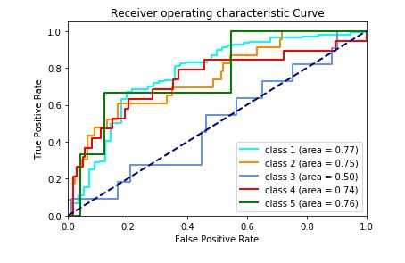

# Autobiographical-Memory-Test-Prediction-Using-SVM

# What is AMT

The Autobiographical Memory Test (AMT) is used to assess the degree of specificity of autobiographical memory. The 
persons are given a word and then asked to tell a memory regarding that word. It is used to detect psychopathologies 
such as affective disorders, post-traumatic stress disorder, acute stress, schizophrenia or personality disorders.

# Objective

This project aims to automate the scoring of the autobiographical memory test and classify the responses by the people 
into one of the following classes :

	Specific -> 1
	extended -> 2
	categoric -> 3
	semantic associates -> 4
	omission -> 5

This project uses natural language processing tools to extract the features from the input by tokenization, lemmatization 
and further preprocessing. The extracted features are then converted into numerical form by using the 
term frequency-inverse document frequency method. The numerical features are then used to train a SVM classifier 
that classifies the data based on those features. 

# Dependencies

	numpy
	pandas
	sklearn
	nltk
	re
	scipy

# Dataset

For this project we only used FAMT and cod FAMT columns.	

	FAMT1 - FAMT15: responses on the future thinking task, for 15 different cue words. 
	codFAMT1-codFAMT15: manually coded scores

The classification is applied to just FAMT1 column (happy memories) i.e. on a very small data. You can apply it on all 15 columns for further accuracy.

# Results

The results are quite appealing as the accuracy is 73 percent with just 320 responses used for both training and testing. 
For further analyzing ROC curve is drawn for all classes to see how good each class is identified.

It can be seen that except class 3 i.e. categoric memory, every other class is identified clearly. The reason can be seen in 
the SVM.ipyn file where all the top uni and bigrams for all 5 classes have been output and it can be seen that class three 
have very similar unigrams as are in other classes making it difficult for the algorithm to identify it.
A better accuracy can be achieved by increasing the samples for class 3 or increase the dataset in general.
